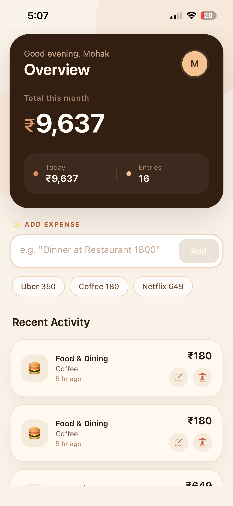
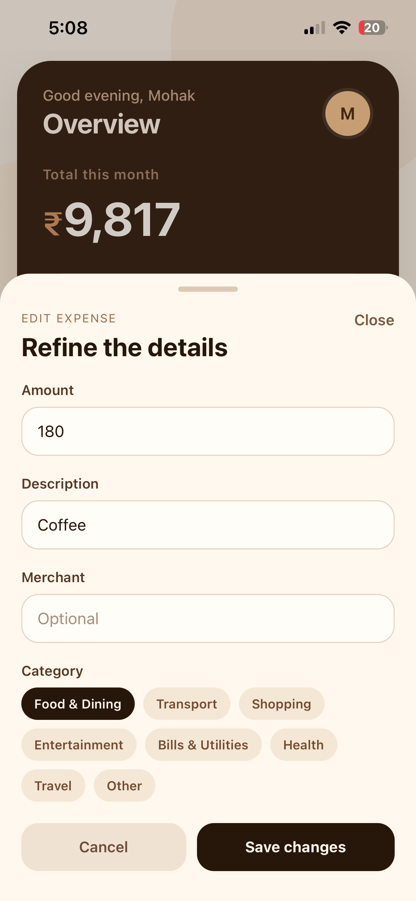
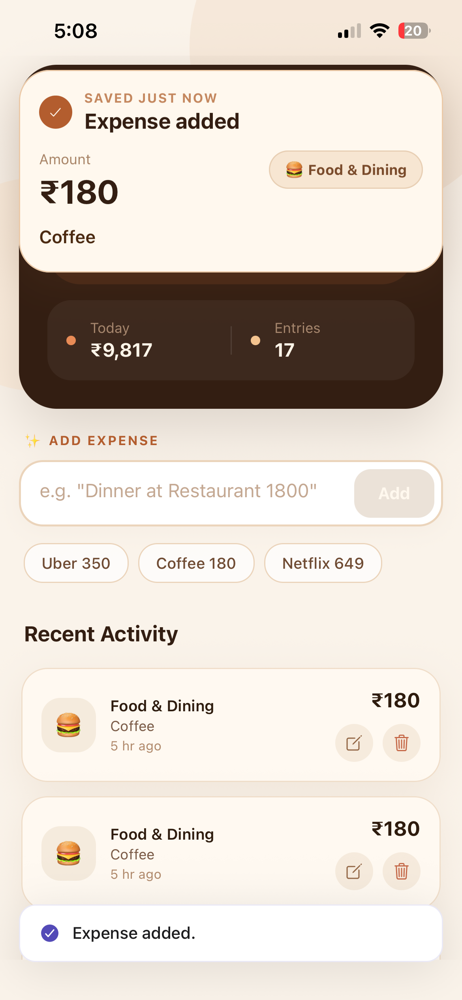
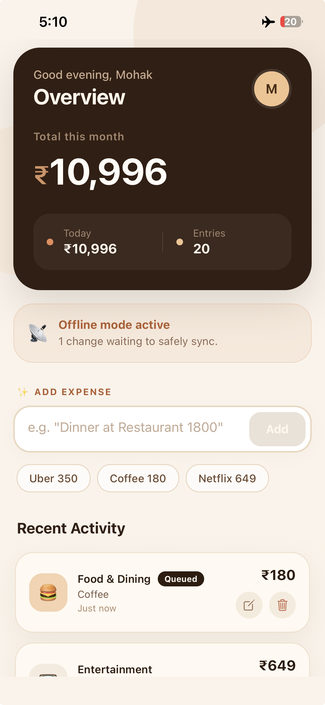

# AI Expense Tracker

A full-stack expense tracking app that uses AI to parse natural language input.

Built by: Mohak
GitHub: https://github.com/Mohak-Agrawal
Time to build: ~1.5 hours (with AI assistance)

## 🎥 Demo

https://drive.google.com/file/d/12-Eh4TyHahz2wlK4RxjvqJFfLWqtsAyk/view?usp=sharing

## 📱 Mobile Screenshots

<p align="center">
	
	
	
	
</p>

## ✨ Features

- Natural-language expense entry such as `Uber to airport 450` or `Lunch at Taj 850`
- AI-assisted categorization with Gemini
- Local fallback parsing when AI is unavailable
- Edit and delete expense flows
- Offline-first mobile experience with local cache and deferred sync queue
- Success popup and toast-style feedback
- Responsive Expo app for web, iOS, and Android
- Unit tests for backend routes, AI parsing behavior, offline queue logic, and local parsing

## 🛠️ Tech Stack

- Mobile: React Native, Expo, TypeScript
- Backend: Node.js, Express, TypeScript
- Database: SQLite
- AI: Gemini API
- Testing: Vitest, Supertest

## 🚀 Setup Instructions

### Prerequisites

- Node.js 18+
- npm or yarn
- Expo CLI or Expo-compatible simulator / emulator / Expo Go
- Gemini API key

### Backend

```bash
cd backend
npm install
cp .env.example .env
# Add GEMINI_API_KEY to .env
npm run dev
```

The backend listens on port `3000` and binds to `0.0.0.0`, so it can be reached by web, emulator, and device clients on your local network.

Optional health check:

```bash
curl http://localhost:3000/health
```

### Mobile

```bash
cd mobile
npm install
cp .env.example .env
npm start
```

Default API behavior:

- Web uses `http://localhost:3000`
- Android emulator uses `http://10.0.2.2:3000`
- Expo/native clients try to resolve the host machine automatically

If you are testing on a physical device, set `EXPO_PUBLIC_API_URL` in `mobile/.env` to your machine's LAN IP, for example:

```bash
EXPO_PUBLIC_API_URL=http://192.168.1.10:3000
```

## 📁 Project Structure

The project is split into a backend API and an Expo mobile client.

```text
ai-expense-tracker/
├── backend/
│   ├── src/
│   │   ├── app.ts
│   │   ├── index.ts
│   │   ├── database/db.ts
│   │   ├── routes/expenses.ts
│   │   └── services/aiService.ts
│   └── .env.example
├── mobile/
│   ├── App.tsx
│   ├── app.json
│   ├── .env.example
│   └── src/
│       ├── components/
│       ├── screens/ExpenseTrackerScreen.tsx
│       ├── services/
│       ├── types/
│       └── utils/
└── README.md
```

## 🤖 AI Prompt Design

I used this system prompt for expense parsing:

```text
You are an expense parser. Extract expense information from natural language input.

RULES:
1. Extract the amount as a number (no currency symbols)
2. Default currency is INR unless explicitly mentioned (USD, EUR, etc.)
3. Categorize into EXACTLY one of: Food & Dining, Transport, Shopping, Entertainment, Bills & Utilities, Health, Travel, Other
4. Description should be a clean short summary
5. Merchant is the company/store name if mentioned, null otherwise
6. Food items, beverages, snacks, restaurant orders, and takeout such as burger, pizza, sandwich, coffee, tea, lunch, dinner, breakfast, snacks, cafe, or meal belong in Food & Dining

EXAMPLES:
- "burger 200" -> Food & Dining
- "pizza night 450" -> Food & Dining
- "coffee 180" -> Food & Dining
- "tea and snacks 120" -> Food & Dining
- "uber to airport 450" -> Transport

RESPOND ONLY WITH VALID JSON, no markdown, no backticks.
```

Why this worked well:

- The prompt forces a strict schema so the backend can parse the response safely.
- Category constraints reduce hallucinated labels.
- Concrete examples improve classification for ambiguous food inputs.
- The app still has deterministic fallback parsing when AI is unavailable, which keeps offline creation reliable.

## ✅ Verification

Run these before submitting:

```bash
cd backend && npm test && npm run build
cd mobile && npm test && npm run lint
```

## Current Scope

Implemented:

- Natural-language add flow
- Expense list with category icons and totals
- Edit expense functionality
- Delete expense functionality
- Offline cache and queued sync
- Android/web API resolution fixes
- Success popup and toast-style feedback
- Unit tests for key backend and mobile logic

## Notes for Reviewer

- Existing data is stored in `backend/expenses.db`
- Mobile state is cached locally using AsyncStorage
- If AI is not configured, categorization still works through fallback heuristics
